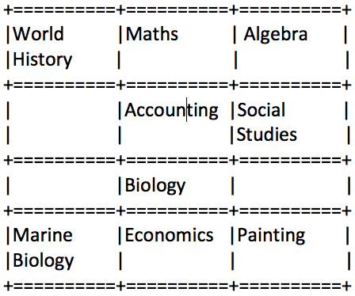

# Welcome to Code & Solve!

Below are 3 coding problems – see if you can solve them! If you would like to share the solution with us, please share the GitHub project url for your solution using the comment option on our LinkedIn post. Let us see **your creativity!!**

Don’t have the LinkedIn post handy? Search in LinkedIn using **#codeandsolve** for our post.

#### Keep these points in mind as you complete this :

1. There is no one correct solution to this problem, there are many
2. The whole point of this exercise is to solve the problem – so fill in any missing info as you see fit
3. Relax and show your style and creativity
4. **See #3**

#### Basic Requirements:

- All code should be accessible from github.com.
- All code should be executable and delivered with test cases.
- Any frameworks or build tools can be used as long as complete projects are included with all instructions to execute it.
- Detailed error/exception handling is not required, but encouraged
- Additional functionality/creativity/user interface is allowed and encouraged, but not required

### Problem 1: Encourage Donation

Sarah owns a Cookie shop. Sarah has a limited number of types of cookies, but she has an unlimited supply of each type. In her shop every cookie is associated with a donation amount - which means every time someone buys a cookie, she donates that amount to charity and keeps the remainder.  Sarah wants to encourage people to buy the cookies with the highest donation amounts to maximize what she gives to charity. 

###### Rules:

- No limit on maximum amount that a person can use.
- Each cookie has a name, price and donation amount. 
- Name should be less than 20 characters
- Price and Donation amount should be > 0
- Result should display maximum donation amount Sarah can hold with the combination of cookies.

|Sample Input   (Format:   Maximum Money   Name of the Cookie, Price ($), Donation Amount ($))|Sample Output|
|------------|-------------|
|20   A,5,2   B,3,1   C,7,4   D,9,3   E,1,0|10 (7,7,5,1)|

### Problem 2: Cash Back Application

John and his friends are planning to design a product to help people match prices on products at different sellers. The idea is not to match price for all purchases but for only one product in a day, depending on the price and popularity of the products.

###### Rules:

- Users have to submit name, product name, and price to the application and at end of each day the one top product with the lowest price will be selected
- All the words are strings of size from 1 to 20 characters
- Name of people may coincide.
- At the end of given time 
  - Display top product (only one) with name and price.
  - Display name of other people bought same device along with eligible cash back amount (different between their purchase and lowest price).
  - Do not display if the difference is 0.

|Sample Input|Sample Output|
|------------|-------------|
|John   iPhone6   625   Tim   GalaxyS7   685   Norman   iPhone6   618   Alex   GalaxyS7   700   Sam   iPhone6   610  |iPhone6 610   John – 15   Norman – 8 |

### Problem 3: Help with Time Table

Smith needs some help in preparing a timetable for his school. Outside of school he is also a part-time employee at a nearby art gallery, so having a proper time table is critical.  Smith has received his courses, and the day and period during the day when it occurs. He now wants to create a table with these details.

###### Rules:

- The application needs to accept 3 different pieces of data. 
  - Total number of courses that Smith will attend (this is number)
  - Course name - The name of the course may consist of up to five words, which are divided by exactly one space (there are no spaces before the first word and after the last one). The words consist of capital and lowercase Latin letters. The length of every word is within the range from 1 to10.
  - Course Schedule - Course Schedule - Description contains the day of week and the lesson period (which time slot during the day).   The day of week may take one of the three values: “Monday”, “Wednesday” or “Friday”. The lesson period is an integer from 1 to 5. 
- The resulting table should be 4×3 in size
  - The columns of the table should correspond to the three academic days
  - Rows should correspond to the four lesson periods. 
  - Width of each column should be equal to 10 characters. 
  - Height of the row of the table equals to the height of the highest of its cells. 
  - If all the cells in the row are empty, then the height of the row should be equal 1 character. I
  - If some word doesn’t find room in the current line, it should be placed in the next line. 
  - The text in the cell should be aligned to top and left borders. Make the table itself using characters “=”, “+” and “|”

|Sample Input|Sample Output|
|------------|-------------|
|9 Biology Wednesday 3 World History Monday 1 Maths  Wednesday 1 Social Studies Friday 2 Painting Friday 4 Marine Biology Monday 4  Algebra Friday 1  Accounting Wednesday 2 Economics Wednesday 4||

### Contributing

We welcome Your interest in the American Express Open Source Community on Github. Any Contributor to any Open Source Project managed by the American Express Open Source Community must accept and sign an Agreement indicating agreement to the terms below. Except for the rights granted in this Agreement to American Express and to recipients of software distributed by American Express, You reserve all right, title, and interest, if any, in and to Your Contributions. Please [fill out the Agreement](https://cla-assistant.io/americanexpress/).

### License

Any contributions made under this project will be governed by the [Apache License 2.0](https://github.com/americanexpress/codeandsolve/blob/master/LICENSE).

### Code of Conduct

This project adheres to the [American Express Community Guidelines](https://github.com/americanexpress/codeandsolve/wiki/Code-of-Conduct).
By participating, you are expected to honor these guidelines.
